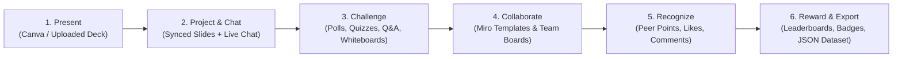
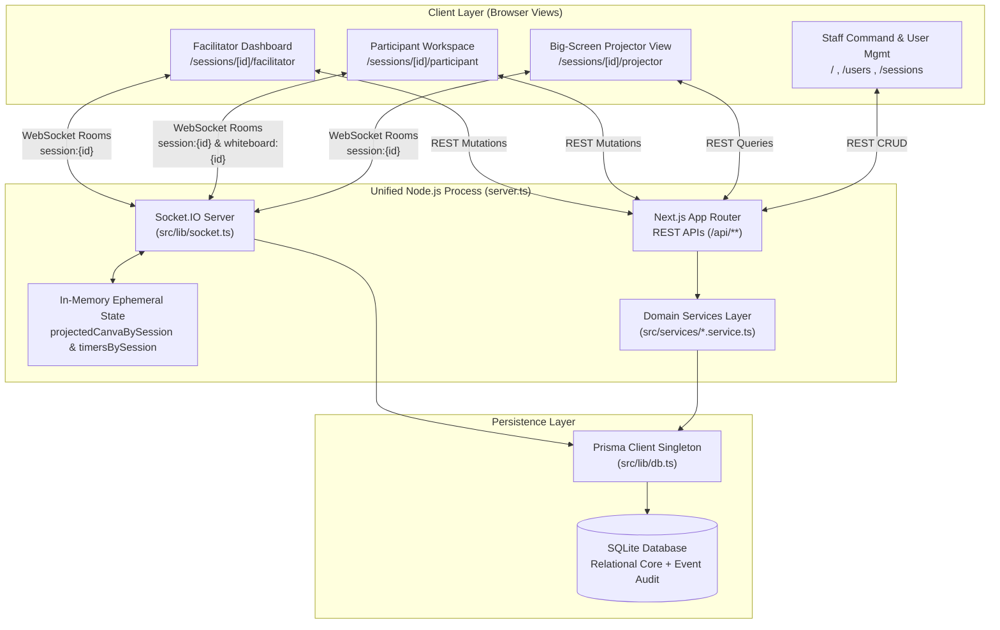
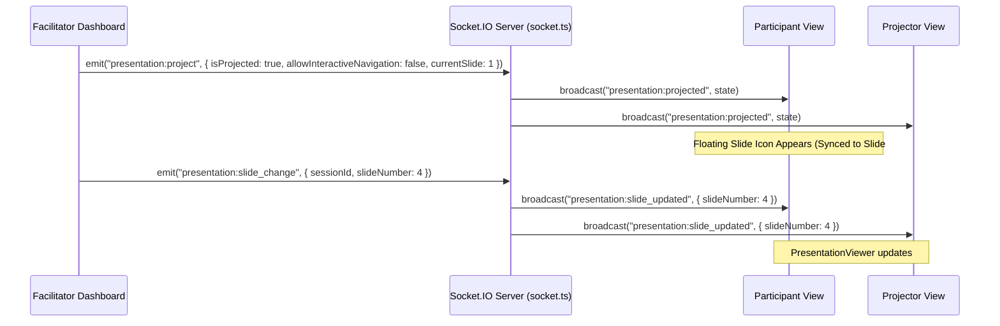
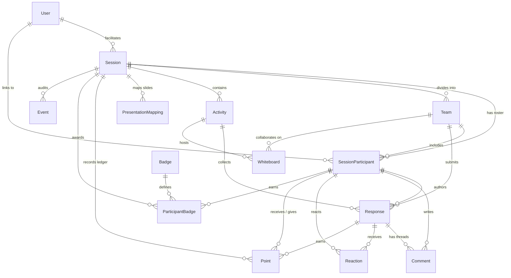

# Training Game Management System (TGMS) — Technical Architecture Manual

**Version:** 2.0  
**Last Updated:** 2026-10-02  
**Target Audience:** Software Engineers, System Architects, Technical Trainers, and Operations Teams

---

## Reading Paths by Role

- **New Developers**: Start with [Chapter 1: Executive Summary](#1-executive-summary), [Chapter 2: Architecture Overview](#2-architecture-overview), and [Chapter 4: Core Components](#4-core-components).
- **System Architects**: Focus on [Chapter 2: Architecture Overview](#2-architecture-overview), [Chapter 3: Design Decisions](#3-design-decisions-rationale--trade-offs), [Chapter 5: Data Models](#5-data-models--persistence), and [Chapter 9: Security Model](#9-security-model--role-based-access-control).
- **Operations & QA Engineers**: Review [Chapter 6: Integration Points](#6-integration-points-rest-apis--socketio-events), [Chapter 7: Deployment Architecture](#7-deployment-architecture--operations), and [Chapter 10: Appendices & Troubleshooting](#10-appendices--troubleshooting-guide).

---

## 1. Executive Summary

The **Training Game Management System (TGMS)** is a real-time collaborative training, presentation, and gamified learning platform designed for both in-person classrooms and remote/hybrid workshops. It bridges existing instructional slide decks (**Canva presentations** and uploaded **PDF / Image / PPTX decks**) with live audience participation, **Miro-style collaborative whiteboards**, **real-time presentation live chat**, **peer-to-peer point gifting**, **automated digital badges**, and **complete JSON dataset export**.

### Core Learning & Facilitation Loop

### Key Capabilities at a Glance

| Capability Domain | Key Features | Primary Implementation |
| :--- | :--- | :--- |
| **Role Portals & RBAC** | Dedicated Staff Login (`/login`) & Participant Session Code Join (`/`); 4-tier RBAC (`SUPER_ADMIN`, `ADMIN`, `FACILITATOR`, `PARTICIPANT`) | [`src/app/login/page.tsx`](../src/app/login/page.tsx), [`src/lib/auth.ts`](../src/lib/auth.ts), [`src/services/user.service.ts`](../src/services/user.service.ts) |
| **Screen Projection & Slide Sync** | Full-deck Canva embed & uploaded deck (`PDF`, `IMAGES`, `PPTX`) projection; toggleable `allowInteractiveNavigation` with presenter-to-participant slide lock (`#N` / `#page=N`) | [`src/components/PresentationViewer.tsx`](../src/components/PresentationViewer.tsx), [`src/lib/socket.ts`](../src/lib/socket.ts) |
| **Real-Time Presentation Live Chat** | Instantaneous Socket.IO chat across Facilitator, Participant, and Projector views; Hide/Unhide Chat toggle; inline facilitator feedback, points (`+2`, `+5`, `+10`), and badges | [`src/components/PresentationViewer.tsx`](../src/components/PresentationViewer.tsx), [`src/app/api/sessions/[id]/presentation/chat/route.ts`](../src/app/api/sessions/[id]/presentation/chat/route.ts) |
| **Miro-Style Whiteboards** | Excalidraw-powered canvas with 6 built-in templates (Kanban, Mind Map, SWOT, Retrospective, Flowchart, Sticky Grid) and 3 scopes (`INDIVIDUAL`, `TEAM`, `PUBLIC`) | [`src/components/CollaborativeWhiteboard.tsx`](../src/components/CollaborativeWhiteboard.tsx), [`src/services/whiteboard.service.ts`](../src/services/whiteboard.service.ts) |
| **Gamification & Peer Rewards** | 20-point starting peer budget, `+1/+3/+5` peer gifting with reasoning, immutable `Point` ledger, rule-based `Badge` triggers, celebratory modals | [`src/services/peer-interaction.service.ts`](../src/services/peer-interaction.service.ts), [`src/services/scoring.service.ts`](../src/services/scoring.service.ts), [`src/components/AwardNotificationModal.tsx`](../src/components/AwardNotificationModal.tsx) |
| **Profiles, Avatars & Settings** | Persistent top-right avatar (`UserAvatarButton`), "View Profile" modal with Facilitator Created Sessions tab & Participant JSON export, `/settings` profile editor | [`src/components/UserAvatarButton.tsx`](../src/components/UserAvatarButton.tsx), [`src/components/ParticipantDetailModal.tsx`](../src/components/ParticipantDetailModal.tsx), [`src/app/settings/page.tsx`](../src/app/settings/page.tsx) |
| **Session Conclusion & Export** | Clean facilitator conclusion redirecting to paginated Home screen (`6` sessions/page); synchronous `schema_version: "1.0"` JSON export | [`src/app/api/sessions/[id]/conclude/route.ts`](../src/app/api/sessions/[id]/conclude/route.ts), [`src/services/export.service.ts`](../src/services/export.service.ts) |

---

## 2. Architecture Overview

TGMS runs as a **Unified Node.js Application Server** ([`server.ts:1-25`](../server.ts#L1-L25)) that mounts both the **Next.js App Router** (handling SSR pages and REST API routes) and a stateful **Socket.IO WebSocket Server** ([`src/lib/socket.ts:28-321`](../src/lib/socket.ts#L28-L321)) on a single HTTP port (`3000` by default). Persistence is managed via **Prisma ORM** backed by **SQLite** ([`prisma/schema.prisma:1-231`](../prisma/schema.prisma#L1-L231)).

### 2.1 High-Level System Topology

### 2.2 Dual-State Pattern: Authoritative REST + Low-Latency Socket Relay

TGMS separates **durable state transitions** from **ephemeral real-time synchronization**:
1. **Durable Writes via REST**: Every critical state change (creating an activity, submitting a response, gifting peer points, posting a presentation chat message, concluding a session) executes first against a Next.js API Route (`src/app/api/**`), which validates permissions and commits a Prisma transaction (alongside an `Event` audit record).
2. **Instantaneous Fan-out via Socket.IO**: Immediately after the REST mutation succeeds, the client or server emits a domain socket event (e.g., `presentation:chat_message`, `point:award`, `presentation:slide_change`) to `session:{sessionId}`, triggering immediate UI updates and toast confirmations across all connected views.

---

## 3. Design Decisions (Rationale & Trade-offs)

All significant architectural decisions are recorded as individual ADRs under [`docs/adr/`](./adr/). Below is the synthesized rationale behind the core system patterns:

### 3.1 Unified Node.js Process ([ADR-0001](./adr/0001-unified-node-server-nextjs-socketio.md))
- **Context**: Real-time classroom games require sub-100ms WebSocket broadcasts alongside Next.js API routes.
- **Decision**: Boot Next.js inside a custom HTTP server ([`server.ts:12-24`](../server.ts#L12-L24)) and attach Socket.IO to the same HTTP server instance, storing the singleton on `globalThis` ([`src/lib/socket.ts:5-26`](../src/lib/socket.ts#L5-L26)).
- **Why**: Eliminates CORS complexity, separate WebSocket deployment processes, and external Redis pub/sub requirements for single-node deployments.

### 3.2 Interactive & Presenter-Synchronized Screen Projection ([ADR-0016](./adr/0016-interactive-presentation-projection-and-live-chat.md))
- **Context**: Previously ([ADR-0003](./adr/0003-facilitator-projected-presentation-boundary.md)), presentations were only displayed on the facilitator's device. However, hybrid/remote participants need to view slides directly on their own screens, and facilitators need control over whether participants can browse ahead or must follow the presenter's exact slide.
- **Decision**: Introduce live **Screen Projection** (`presentation:project`) with a facilitator-controlled `allowInteractiveNavigation` policy and `currentSlide` tracking in [`src/lib/socket.ts:96-176`](../src/lib/socket.ts#L96-L176):
  - When `allowInteractiveNavigation === false`, participant slide controls are locked and [`PresentationViewer.tsx:168-174`](../src/components/PresentationViewer.tsx#L168-L174) synchronizes `currentSlide` with `externalSlide`, dynamically updating the iframe hash (`#N` for Canva, `#page=N` for PDF) or image deck index.
  - When `allowInteractiveNavigation === true`, participants can open a floating or fullscreen projection modal and navigate slides independently.

### 3.3 Real-Time Presentation Live Chat & Confirmation Effects ([ADR-0016](./adr/0016-interactive-presentation-projection-and-live-chat.md))
- **Context**: During slide presentations, participants need a live backchannel to ask questions and share insights, while facilitators need to coach, reply, and reward participants without leaving the presentation view.
- **Decision**: Back presentation chat with a dedicated hidden `PRESENTATION_CHAT` activity in Prisma ([`src/app/api/sessions/[id]/presentation/chat/route.ts`](../src/app/api/sessions/[id]/presentation/chat/route.ts)) so that every chat message is stored as a first-class `Response` entity capable of receiving `Comment` replies, `Reaction` likes, `Point` awards, and `ParticipantBadge` grants. Real-time updates broadcast via `presentation:chat_updated` across Facilitator, Participant, and Projector views, accompanied by [`SentConfirmationEffect.tsx`](../src/components/SentConfirmationEffect.tsx) visual notifications.

### 3.4 Facilitator-Allocated Peer Point Budget ([ADR-0007](./adr/0007-facilitator-allocated-peer-point-budget.md)) & Append-Only Ledger ([ADR-0011](./adr/0011-append-only-point-ledger-with-materialized-cache.md))
- **Context**: Allowing unrestricted peer-to-peer point gifting causes score inflation, whereas spending earned points discourages generosity.
- **Decision**: Grant each `SessionParticipant` a dedicated `peerPointBudget` of `20` points ([`prisma/schema.prisma:62`](../prisma/schema.prisma#L62)). Gifting `+1`, `+3`, or `+5` points deducts from `giver.peerPointBudget` while appending an immutable `Point` record and incrementing `recipient.totalPoints` and `team.totalPoints` inside a single atomic Prisma transaction ([`src/services/peer-interaction.service.ts`](../src/services/peer-interaction.service.ts)).

---

## 4. Core Components

### 4.1 Frontend Views (`src/app/`)

| Route | Source File | Responsibility |
| :--- | :--- | :--- |
| `/` | [`src/app/page.tsx`](../src/app/page.tsx) | **Dual-Purpose Entry & Command Hub**: Renders the Participant Session Code join screen for unauthenticated/participant users, and a clean, paginated **Command Homepage** (`6` sessions per page) for authenticated Facilitators, Admins, and Super Admins. |
| `/login` | [`src/app/login/page.tsx`](../src/app/login/page.tsx) | **Dedicated Staff Sign-In Portal**: Username/password login strictly for `FACILITATOR`, `ADMIN`, and `SUPER_ADMIN` roles (no session code input). |
| `/settings` | [`src/app/settings/page.tsx`](../src/app/settings/page.tsx) | **User Edit Info & Settings Page**: Standalone account settings page for updating display name, username, email, bio, avatar color, organization, and password. |
| `/users` | [`src/app/users/page.tsx`](../src/app/users/page.tsx) | **User Directory & Role Management**: Allows `ADMIN` and `SUPER_ADMIN` to create, bulk-generate, edit, or delete users; read-only directory with **"View Profile"** inspection for `FACILITATOR`. |
| `/sessions` | [`src/app/sessions/page.tsx`](../src/app/sessions/page.tsx) | **Session Directory & Facilitator Assignment**: Lists sessions, allows `ADMIN`/`SUPER_ADMIN` to assign sessions across facilitators, and exports JSON datasets. |
| `/sessions/[id]/facilitator` | [`src/app/sessions/[id]/facilitator/page.tsx`](../src/app/sessions/[id]/facilitator/page.tsx) | **Facilitator Command Center**: Controls presentation linking/uploading, live screen projection, interactive navigation toggle, live chat enable/disable, digital timers, activity lifecycle (`DRAFT` → `ACTIVE` → `LOCKED` → `COMPLETED`), team auto-split, and session conclusion. |
| `/sessions/[id]/participant` | [`src/app/sessions/[id]/participant/page.tsx`](../src/app/sessions/[id]/participant/page.tsx) | **Participant Workspace**: Displays active challenges, Miro-style whiteboards, floating projected slide viewer, real-time presentation live chat, peer point gifting, and bottom-anchored standings (`#session-leaderboard`). |
| `/sessions/[id]/projector` | [`src/app/sessions/[id]/projector/page.tsx`](../src/app/sessions/[id]/projector/page.tsx) | **Big-Screen Projector View**: Audience-facing stage window (`max-h-[85vh]`) displaying projected slides, toggleable real-time presentation chat, synchronized digital timer, and spotlighted works. |

### 4.2 Shared Interactive Components (`src/components/`)

1. **[`PresentationViewer.tsx`](../src/components/PresentationViewer.tsx)** (`lines 1-940`):
   - Parses and renders Canva embed URLs (`parsePresentationConfig`), uploaded PDFs, image slide decks, and PPTX links.
   - Enforces `allowInteractiveNavigation`: locks participant slide controls and syncs to `externalSlide` when disabled; provides slide steppers (`Prev`/`Next`) and broadcast callbacks (`onSlideChange`) for facilitators.
   - Embeds the **Real-Time Presentation Live Chat** sidebar with **Hide Chat / Show Chat** toggle button (`isChatSidebarVisible`), threaded replies, facilitator point buttons (`+2`, `+5`, `+10`), and badge selectors.

2. **[`CollaborativeWhiteboard.tsx`](../src/components/CollaborativeWhiteboard.tsx)** (`lines 1-920`):
   - Wraps `@excalidraw/excalidraw` with real-time Socket.IO scene broadcasting (`whiteboard:draw` / `whiteboard:scene_updated`).
   - Provides 6 one-click **Miro-Style Templates**: *Kanban Board*, *Mind Map*, *SWOT Analysis*, *Sprint Retrospective*, *Flowchart*, and *Brainstorming Sticky Grid*.
   - Automatically bridges submitted whiteboards into `Response` records (`color: "WHITEBOARD"`) so peers can like, comment, and gift points to whiteboards.

3. **[`ParticipantDetailModal.tsx`](../src/components/ParticipantDetailModal.tsx)** (`lines 1-745`):
   - Unified **"View Profile"** modal inspectable from User Management, Top-Right Avatar, and Session Rosters.
   - Renders role-aware tabs:
     - **Created Sessions Tab** (for `FACILITATOR`, `ADMIN`, `SUPER_ADMIN`): Displays profile stats, total sessions created/hosted, and detailed cards for every created session.
     - **Overview / Interactions / Points & Awards Tabs** (for `PARTICIPANT`): Displays session points, badges, whiteboards, responses, comments, and a **Download JSON** button.
     - **Edit Info & Settings Tab**: Inline profile editor synced with `/api/users/[id]` and `localStorage`.

4. **[`UserAvatarButton.tsx`](../src/components/UserAvatarButton.tsx)** (`lines 1-230`):
   - Top-right corner interactive avatar rendered across all pages. Displays user initials, custom avatar color, role badge, and opens `ParticipantDetailModal` when clicked.

5. **[`SentConfirmationEffect.tsx`](../src/components/SentConfirmationEffect.tsx)** (`lines 1-115`):
   - Non-blocking animated toast notification supporting `MESSAGE_SENT`, `MESSAGE_RECEIVED`, `FEEDBACK`, `POINTS`, `AWARD`, and `COMMENT` confirmation types.

### 4.3 Backend Domain Services (`src/services/`)

- **[`session.service.ts`](../src/services/session.service.ts)**: Session creation, unique 6-character code generation, ephemeral participant joining, token recovery, and session conclusion.
- **[`activity.service.ts`](../src/services/activity.service.ts)**: Enforces the single-active-activity state machine (`DRAFT`, `ACTIVE`, `LOCKED`, `COMPLETED`), handles response submissions, and calculates results for `POLL`, `QUIZ`, `WORD_CLOUD`, `QA`, and `RANKING` (Borda count).
- **[`peer-interaction.service.ts`](../src/services/peer-interaction.service.ts)**: Manages `Reaction` toggles (`LIKE`, `HEART`, `CLAP`, `STAR`), threaded `Comment` creation, and `peerPointBudget` validation/deduction during peer point gifting.
- **[`scoring.service.ts`](../src/services/scoring.service.ts)** & **[`badge.service.ts`](../src/services/badge.service.ts)**: Executes transactional point ledger inserts, recalculates individual and team leaderboards, and evaluates automatic badge triggers (`AUTOMATIC_POINTS`, `AUTOMATIC_RESPONSES`).
- **[`export.service.ts`](../src/services/export.service.ts)**: Aggregates and serializes the complete `schema_version: "1.0"` session dataset for synchronous JSON download.

---

## 5. Data Models & Persistence

The relational schema is defined in [`prisma/schema.prisma:1-231`](../prisma/schema.prisma#L1-L231).

### 5.1 Entity-Relationship Diagram

### 5.2 Core Model Specifications

| Model | Lines in `schema.prisma` | Key Fields & Domain Invariants |
| :--- | :--- | :--- |
| **`User`** | `10-20` | `id`, `username` (unique), `email` (unique), `role` (`SUPER_ADMIN`, `ADMIN`, `FACILITATOR`, `PARTICIPANT`). Extended profile metadata (`bio`, `organization`, `avatarColor`) is supported via user API endpoints. |
| **`Session`** | `22-42` | `code` (unique 6-char alphanumeric), `status` (`WAITING`, `ACTIVE`, `CONCLUDED`/`COMPLETED`), `facilitatorId`, `canvaPresentationUrl` (stores raw Canva URL or JSON deck config for uploaded `PDF`/`IMAGES`/`PPTX`), `leaderboardVisibility`. |
| **`SessionParticipant`** | `55-77` | `displayName`, `token` (signed recovery token), `peerPointBudget` (default `20`), `totalPoints` (materialized sum), `teamId`, `userId`, `isConnected`. |
| **`Activity`** | `92-114` | `type` (`OPEN_QUESTION`, `POLL`, `QUIZ`, `WORD_CLOUD`, `QA`, `RANKING`, `WHITEBOARD_TEAM`, `WHITEBOARD_INDIVIDUAL`, `WHITEBOARD_PUBLIC`, `PRESENTATION_CHAT`), `state` (`DRAFT`, `ACTIVE`, `LOCKED`, `COMPLETED`), `revealMode` (`IMMEDIATE`, `UPON_LOCK`), `timerStatus`, `timerEndsAt`. |
| **`Response`** | `116-132` | `content`, `color` (`"WHITEBOARD"` for bridged whiteboards, `"PRESENTATION_CHAT"` for live chat messages, or hex/sticky color), `isHidden`. |
| **`Comment`** | `134-146` | Self-referential `parentId` supporting nested threaded replies on both activity responses and presentation live chat messages. |
| **`Reaction`** | `148-158` | Composite unique constraint `@@unique([responseId, participantId, type])` guaranteeing idempotent toggle behavior. |
| **`Point`** | `160-178` | Append-only ledger tracking `category` (`PARTICIPATION`, `PEER`, `CHALLENGE`, `FACILITATOR`, `TEAM`, `BONUS`), `amount`, `participantId` (recipient), `giverId`, `responseId`, and `reason`. |
| **`Whiteboard`** | `180-193` | `sceneData` (JSON serialized Excalidraw elements and appState), `isSubmitted`, scoped by `participantId` or `teamId`. |
| **`Badge` & `ParticipantBadge`** | `195-217` | `ruleType` (`AUTOMATIC_POINTS`, `AUTOMATIC_RESPONSES`, `MANUAL`), `ruleValue`, `awardedBy` (`SYSTEM` or Facilitator). |
| **`Event`** | `219-230` | Chronological audit log (`eventType`, `actorId`, `targetId`, `metadata` JSON) written alongside state transitions. |

---

## 6. Integration Points (REST APIs & Socket.IO Events)

### 6.1 REST API Catalog (`src/app/api/`)

| Endpoint | Methods | Purpose & Authorization |
| :--- | :--- | :--- |
| `/api/auth/login` | `POST` | Authenticates credentials and returns a signed user token + user profile ([`src/app/api/auth/login/route.ts`](../src/app/api/auth/login/route.ts)). |
| `/api/users` & `/api/users/[id]` | `GET, POST, PATCH, DELETE` | User CRUD and profile updates. Creating/deleting users is restricted to `ADMIN` and `SUPER_ADMIN`; self-profile updates (`PATCH /api/users/[id]`) are permitted for any authenticated user. |
| `/api/sessions` & `/api/sessions/[id]` | `GET, POST, PATCH, DELETE` | Lists and manages sessions; supports filtering by `facilitatorId` for facilitator profile inspection. |
| `/api/sessions/join` & `/api/sessions/reconnect` | `POST` | Joins a session via 6-character `code` or recovers a session via `participantToken`. |
| `/api/sessions/[id]/assign` | `PATCH` | Reassigns a session to another facilitator (`ADMIN` and `SUPER_ADMIN` only). |
| `/api/sessions/[id]/conclude` | `POST` | Transitions a session to `CONCLUDED`, stops active timers/activities, and logs `SESSION_CONCLUDED`. |
| `/api/sessions/[id]/presentation` | `POST, DELETE` | Links or deletes a Canva presentation URL or uploaded deck configuration on the session. |
| `/api/sessions/[id]/presentation/upload` | `POST` | Uploads a presentation deck (`PDF`, `IMAGES`, or `PPTX` metadata/data URLs) to the session. |
| `/api/sessions/[id]/presentation/chat` | `GET, POST` | Fetches and posts real-time Presentation Live Chat messages and threaded replies. |
| `/api/sessions/[id]/export/json` | `GET` | Streams the complete session dataset (`schema_version: "1.0"`) as a downloadable `.json` attachment. |
| `/api/activities/[id]/state` & `/timer` | `PATCH, POST` | Transitions activity state (`DRAFT`/`ACTIVE`/`LOCKED`/`COMPLETED`) and controls countdown timers. |
| `/api/responses/[id]/points`, `/comments`, `/reactions` | `POST` | Awards facilitator/peer points, adds threaded comments, and toggles reactions on any response or chat message. |

### 6.2 Socket.IO Real-Time Event Matrix (`src/lib/socket.ts`)

All session participants, facilitators, and projector windows join the Socket.IO room `session:{sessionId}` upon emitting `session:join` ([`src/lib/socket.ts:49-77`](../src/lib/socket.ts#L49-L77)).

| Client-Emitted Event | Server-Broadcast Event | Payload Summary | Handler Location |
| :--- | :--- | :--- | :--- |
| `session:join` | `session:roster_updated`, `presentation:projected`, `timer:updated` | `{ sessionId, participantId, isFacilitator }` | [`socket.ts:49-77`](../src/lib/socket.ts#L49-L77) |
| `presentation:project` | `presentation:projected` | `{ isProjected, canvaPresentationUrl, chatEnabled, allowInteractiveNavigation, currentSlide }` | [`socket.ts:129-176`](../src/lib/socket.ts#L129-L176) |
| `presentation:slide_change` | `presentation:slide_updated`, `presentation:projected` | `{ sessionId, slideNumber }` | [`socket.ts:96-105`](../src/lib/socket.ts#L96-L105) |
| `presentation:chat_message` | `presentation:chat_updated` | `{ message, type: "NEW_MESSAGE" }` | [`socket.ts:178-183`](../src/lib/socket.ts#L178-L183) |
| `timer:sync` | `timer:updated` | `{ activityId, timerStatus, timerEndsAt, timerRemainingMs }` | [`socket.ts:189-204`](../src/lib/socket.ts#L189-L204) |
| `activity:change_state` | `activity:state_updated` | `{ activity }` | [`socket.ts:185-187`](../src/lib/socket.ts#L185-L187) |
| `whiteboard:draw` | `whiteboard:scene_updated` | `{ whiteboardId, elements, appState }` (broadcast to `whiteboard:{id}`) | [`socket.ts:218-220`](../src/lib/socket.ts#L218-L220) |
| `whiteboard:project` / `response:project` | `whiteboard:projected` / `response:projected` | `{ whiteboardId }` / `{ responseId }` | [`socket.ts:234-240`](../src/lib/socket.ts#L234-L240) |
| `point:award` | `point:awarded_notification`, `leaderboard:scores_updated`, `presentation:chat_updated` | `{ notificationId, recipientId, amount, reason, giverName }` | [`socket.ts:278-288`](../src/lib/socket.ts#L278-L288) |
| `comment:add` | `comment:received_notification`, `presentation:chat_updated` | `{ notificationId, recipientId, commenterName, content, responseId }` | [`socket.ts:290-303`](../src/lib/socket.ts#L290-L303) |
| `badge:award` | `badge:celebrate` | `{ participantId, badge, reason }` | [`socket.ts:250-252`](../src/lib/socket.ts#L250-L252) |

---

## 7. Deployment Architecture & Operations

### 7.1 Process Execution & Environment Configuration
- **Entrypoint**: `npm run dev` (or `npx tsx server.ts`) executes [`server.ts`](../server.ts), initializing Next.js and attaching the Socket.IO server before listening on `process.env.PORT || 3000`.
- **Database Configuration**: Controlled by `DATABASE_URL` in `.env` (defaulting to `file:./dev.db` inside `prisma/`).
- **In-Memory Ephemeral Caches**:
  - `globalForSocket.projectedCanvaBySession` ([`src/lib/socket.ts:7-16`](../src/lib/socket.ts#L7-L16)): Retains the active projection state (`isProjected`, `canvaPresentationUrl`, `chatEnabled`, `allowInteractiveNavigation`, `currentSlide`) per session so late-joining participants or newly opened Projector Views immediately synchronize upon `session:join`.
  - `globalForSocket.timersBySession` ([`src/lib/socket.ts:17-25`](../src/lib/socket.ts#L17-L25)): Retains running countdown timer targets (`timerEndsAt`, `timerRemainingMs`) for immediate client hydration.

---

## 8. Performance Characteristics & Optimizations

1. **Drift-Free Timestamp Target Timers ([ADR-0008](./adr/0008-server-authoritative-timestamp-target-timer.md))**:
   - Instead of emitting a WebSocket tick every second (which causes network congestion and tab-throttling drift), the server broadcasts an ISO target timestamp (`timerEndsAt`). Clients compute `remaining = timerEndsAt - Date.now()` locally via [`DigitalTimer.tsx`](../src/components/DigitalTimer.tsx).
2. **Scoped Whiteboard Rooms ([ADR-0006](./adr/0006-in-memory-whiteboard-broadcast-with-milestone-persistence.md))**:
   - High-frequency Excalidraw pointer/element deltas (`whiteboard:draw`) are isolated to `whiteboard:{whiteboardId}` rooms rather than flooding the entire `session:{sessionId}` room, while durable snapshots are persisted to SQLite on debounced intervals and explicit submissions.
3. **Materialized Point Totals ([ADR-0011](./adr/0011-append-only-point-ledger-with-materialized-cache.md))**:
   - `SessionParticipant.totalPoints` and `Team.totalPoints` are updated transactionally whenever a `Point` row is inserted, making leaderboard queries (`ORDER BY totalPoints DESC`) $O(1)$ indexed reads without aggregating the ledger on every request.
4. **Optimistic + Socket-Confirmed Live Chat**:
   - In [`PresentationViewer.tsx:249-280`](../src/components/PresentationViewer.tsx#L249-L280), newly sent chat messages are immediately appended to local state (deduplicated by `msg.id`) and broadcast via `presentation:chat_message` with the full message payload, achieving zero-latency chat rendering across Facilitator, Participant, and Projector screens.

---

## 9. Security Model & Role-Based Access Control

### 9.1 Authentication & Token Flows
- **Staff Authentication (`/login`)**: Validates `username` and `password` against `User` records (`FACILITATOR`, `ADMIN`, `SUPER_ADMIN`) via `POST /api/auth/login` and issues an HMAC-signed bearer token (`tgms_user_token`) verified by [`src/lib/auth.ts`](../src/lib/auth.ts).
- **Participant Session Entry (`/`)**: Validates the 6-character `Session.code` via `POST /api/sessions/join` and issues a signed `participantToken` (`tgms_participant_token`), allowing seamless browser refresh recovery (`POST /api/sessions/reconnect`).

### 9.2 Role-Based Access Control (RBAC) Matrix

| Action / Capability | `SUPER_ADMIN` | `ADMIN` | `FACILITATOR` | `PARTICIPANT` |
| :--- | :---: | :---: | :---: | :---: |
| Sign in via Staff Portal (`/login`) | ✅ | ✅ | ✅ | ❌ (Uses `/` with Session Code) |
| Create / Edit / Delete `SUPER_ADMIN` accounts | ✅ | ❌ | ❌ | ❌ |
| Create / Edit / Delete `ADMIN`, `FACILITATOR`, `PARTICIPANT` accounts | ✅ | ✅ | ❌ | ❌ |
| View User Profiles (`View Profile` modal) | ✅ | ✅ | ✅ (Read-Only) | Own Profile Only |
| Edit Own Account Info & Settings (`/settings`) | ✅ | ✅ | ✅ | ✅ |
| Assign Session to Another Facilitator | ✅ | ✅ | ❌ | ❌ |
| Control Any Session in System | ✅ | ✅ | Own / Assigned Sessions Only | ❌ |
| Project Slides, Toggle Interactive Nav & Live Chat | ✅ | ✅ | ✅ (Session Owner) | ❌ |
| Gift Peer Points (from 20-pt budget) | N/A | N/A | Unlimited Bonus Points | ✅ (Cannot self-award) |
| Export Complete Session JSON Dataset | ✅ | ✅ | ✅ (Session Owner) | Own Participant JSON |

---

## 10. Appendices & Troubleshooting Guide

### 10.1 Common Operational Troubleshooting

| Symptom | Root Cause | Resolution |
| :--- | :--- | :--- |
| `npx prisma studio` reports `Could not find Prisma Schema` | Running Prisma CLI outside project root or missing schema path configuration | Run `npx prisma studio` from `c:\Users\ASUS\OneDrive - Kemenkeu\Projects\tgm` where `prisma/schema.prisma` resides. |
| Participant cannot click `Prev` / `Next` on projected slides | Facilitator has disabled **Interactive Navigation** (`allowInteractiveNavigation: false`) | This is by design: when Interactive Navigation is off, participant slides are locked in real-time sync with the presenter's slide. Enable **Interactive Nav** in the Facilitator dashboard to allow free browsing. |
| Live Chat panel is not visible during slide projection | Either the Facilitator disabled Live Chat for the session, or the local **Hide Chat** toggle is active | Ensure **Chat Enabled** is toggled ON in the Facilitator dashboard and click **Show Chat** in the presentation viewer header. |
| Previous session messages/points appear after session ends | Facilitator remained inside `/sessions/[id]/facilitator` instead of concluding | Click **End Session** in the Facilitator dashboard header; this marks the session `CONCLUDED` and redirects to the clean, paginated Home screen (`/`). |

### 10.2 Cross-Reference Documentation
- **Canonical Domain Vocabulary**: [`GLOSSARY.md`](../GLOSSARY.md)
- **Peer Recognition Rules**: [`docs/domain/peer-rewards.md`](./domain/peer-rewards.md)
- **Architecture Decision Records**: [`docs/adr/`](./adr/)
- **Product Requirements Document**: [`docs/Training_Game_Management_System_PRD.md`](./Training_Game_Management_System_PRD.md)
