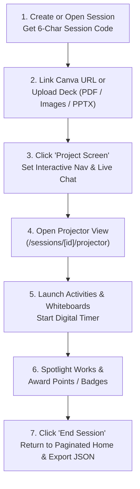

# Facilitator (`FACILITATOR`) User Manual

**Role Identifier:** `FACILITATOR`  
**Sign-In Portal:** `http://localhost:3000/login`  
**Primary Landing Page:** Facilitator Command Homepage (`http://localhost:3000/`)

---

## 1. Role Overview & Capabilities

As a **Facilitator (`FACILITATOR`)**, you are the instructor and game master who designs, launches, and directs live training sessions.

### What You Can Do
- **Create & Run Your Own Sessions**: Create training sessions, generate 6-character **Session Codes**, and manage your session history from a clean, paginated homepage.
- **Connect Canva Links or Upload Presentations**: Link full Canva presentations (without single-slide restrictions), delete/replace links at any time, or upload custom presentation decks (`PDF`, `IMAGES`, `PPTX`).
- **Project Slides & Control Slide Synchronization**: Broadcast your presentation live to participants and the room projector, and choose whether participants can browse freely (**Interactive Navigation ON**) or must follow your exact slide (**Interactive Navigation OFF**).
- **Host Real-Time Presentation Live Chat**: Enable or disable live chat during presentations, toggle **Hide Chat / Show Chat**, reply with coaching feedback, and award points (`+2`, `+5`, `+10`) or badges directly on chat messages.
- **Orchestrate Interactive Activities & Miro Whiteboards**: Launch Polls, Trivia Quizzes, Word Clouds, Q&A, Borda Rankings, Open Questions, Sticky Notes, and Excalidraw Collaborative Whiteboards with built-in templates (Kanban, Mind Map, SWOT, Retrospective, Flowchart, Sticky Grid).
- **Manage Timers, Teams, Scoring & Exports**: Run synchronized digital countdown timers, auto-split participants into balanced teams, spotlight participant works on the main stage, inspect participant profiles, and export complete session JSON datasets.

### Role Boundaries
> **Note on Permissions:**
> 1. **User Management (`/users`)**: Facilitators can browse the user directory and click **View Profile** to inspect participants or fellow facilitators, but **cannot** create, modify, or delete other users (reserved for `ADMIN` and `SUPER_ADMIN`). You can edit **your own** profile and password at any time via your top-right avatar or `/settings`.
> 2. **Session Assignment**: Facilitators manage sessions they created (or sessions assigned to them by an Admin), and **cannot** reassign sessions to other facilitators.

---

## 2. Signing In & Your Paginated Command Homepage

### 2.1 Signing In
1. Go to `http://localhost:3000/login` (**Facilitator & Admin Sign In**).
   > **Note:** You do not need a Session Code to sign in. Session Codes on `/` are only for participants.
2. Enter your **Username** (e.g., `facilitator_maya` or `facilitator_sam`) and **Password**.
3. Click **Sign In to Command Center**.

### 2.2 Your Facilitator Homepage (`/`)
After signing in (or after concluding a session), you land on your **Command Homepage (`/`)**:
- **Clean Session View**: All interactions, points, and chat messages from previous sessions are hidden from the home screen so you have a distraction-free workspace.
- **Paginated Created Sessions**: Lists all sessions you have created (`6` sessions per page, with **Previous / Next** pagination controls).
- **Top-Right Avatar**: Click your avatar in the upper-right corner to view your **Facilitator Profile** (including your total count of **Sessions Created / Hosted** and detailed **Created Sessions** list) or edit your account settings.

---

## 3. Step-by-Step Guide to Running a Live Session

### Step 1: Create or Open a Session
1. From your Command Homepage (`/`), click **Create New Session** (or open an existing session card).
2. Enter the **Session Title** and **Description**, then click **Create**.
3. Open the **Facilitator Dashboard** (`/sessions/[id]/facilitator`).
4. Share the **6-Character Session Code** displayed in the top header with your participants.

---

### Step 2: Connect a Canva Link or Upload a Presentation Deck
In the **Presentation & Stage Studio** panel of your Facilitator Dashboard:

1. **Option A — Link a Canva Presentation**:
   - Paste your Canva presentation URL into the **Canva Presentation Link** input and click **Link Presentation**.
   - **No Slide Number Required**: The entire Canva deck is linked automatically so you can navigate and project all slides freely.
   - **Delete Link**: Click the red **Remove / Delete Link** (trash) button at any time to unlink the presentation and clear active projection.
2. **Option B — Upload Your Own Presentation Deck**:
   - Click **Upload Presentation** to upload a **PDF document (`.pdf`)**, **Slide Images (`.png`, `.jpg`, `.webp`)**, or **PowerPoint (`.pptx`)** deck directly into the session.

---

### Step 3: Project Your Screen & Configure Navigation / Chat Policies
Once a Canva link or uploaded deck is connected:

1. **Start Screen Projection**:
   - Click **Project Screen to Participants** (`Projecting Live`).
   - A floating notification icon immediately pops up on every participant's screen letting them know you are sharing slides.
2. **Control Interactive Navigation (`Interactive Nav: ON / OFF`)**:
   - **When Interactive Navigation is ON**: Participants can open the projected presentation window, expand it to fullscreen, and browse backward/forward through slides at their own pace.
   - **When Interactive Navigation is OFF (Synced to Presenter)**: Participant slide controls are locked. Whenever you click **Prev Slide** or **Next Slide** in your Facilitator Viewer, every participant's screen and the Projector View automatically jump to your exact slide in real time!
3. **Enable / Disable Presentation Live Chat (`Chat: ON / OFF`)**:
   - Toggle **Enable Chat** to allow participants to post real-time questions and comments alongside the projected slides.
   - Toggle **Disable Chat** during focused lecture segments when you want to pause audience messaging.
4. **Hide / Unhide Live Chat Panel (`Hide Chat` / `Show Chat`)**:
   - Click the **Hide Chat** button in the presentation header whenever you want to collapse the chat sidebar and give the slide canvas 100% width; click **Show Chat** to bring it back.

---

### Step 4: Coaching & Rewarding Inside Presentation Live Chat
While Presentation Live Chat is active:
1. Incoming messages from participants appear in real time with an animated notification banner.
2. On any participant's chat message, you can:
   - Click **Reply / Feedback** to post an inline coaching response.
   - Click **`+2`**, **`+5`**, or **`+10`** to immediately award bonus points to that participant.
   - Click **Award Badge** to grant a digital badge for an insightful question or comment.
3. Every time you send a message, reply, feedback, points, or award, an animated **Confirmation Effect** appears at the top-right confirming your action was delivered.

---

### Step 5: Using the Big-Screen Projector View
1. Click **Open Projector View** (`/sessions/[id]/projector`) from the top bar of your Facilitator Dashboard and drag that window onto the classroom projector or video-conference screen share.
2. The Projector View features:
   - **Enlarged Presentation Canvas** (`w-full h-full max-h-[85vh] rounded-2xl overflow-hidden shadow-2xl border border-slate-800 bg-black`).
   - **Real-Time Presentation Live Chat** alongside the slides, complete with a **Hide Chat / Show Chat** toggle button.
   - **Synchronized Digital Countdown Timer** (`DigitalTimer`) in the header whenever an activity timer is running or paused.

---

### Step 6: Launching Interactive Activities & Miro Collaborative Whiteboards
1. In the **Activities** panel, click **Create Activity** and choose an activity type:
   - **Open Question / Sticky Notes**: Collect brainstorm cards with configurable **Reveal Mode** (`IMMEDIATE` stream vs. concealed `UPON_LOCK`).
   - **Live Poll / Trivia Quiz**: Multiple-choice questions with instant visual bar charts and automated scoring for correct quiz answers.
   - **Word Cloud**: Real-time frequency-weighted word cloud.
   - **Q&A Session**: Audience questions with single-vote upvoting, spotlighting, and answered status toggles.
   - **Priority Ranking**: Borda-count drag-and-drop ranking.
   - **Collaborative Whiteboard (`WHITEBOARD_INDIVIDUAL`, `WHITEBOARD_TEAM`, `WHITEBOARD_PUBLIC`)**:
     - Powered by Excalidraw with 6 built-in **Miro-Style Templates**: *Kanban Board*, *Mind Map*, *SWOT Analysis*, *Sprint Retrospective*, *Flowchart*, and *Brainstorming Sticky Grid*.
2. **Control Activity Lifecycle**:
   - Transition an activity from `DRAFT` → **`ACTIVE`** (opens participant submissions) → **`LOCKED`** (freezes submissions and reveals responses) → **`COMPLETED`**.
3. **Run the Digital Timer**:
   - Set a duration (e.g., `60s`, `180s`, `300s`) and click **Start Timer**. You can **Pause**, **Resume**, **`+30s`**, or **Stop** the timer at any time—all participant screens and the Projector View stay synchronized to the millisecond.
4. **Project a Participant's or Team's Work**:
   - Click **Project to Stage** on any submitted whiteboard or response to spotlight it on all participant screens (`ProjectedWorkModal`) so peers can inspect it, like it, comment, and gift peer points.

---

### Step 7: Inspecting Participant Profiles & Concluding the Session
1. **Inspect Any Participant**:
   - Click any participant in the **Session Roster** (or in `/users`) to open their **View Profile** modal showing their **Participant Info**, **Session Info**, **Points Breakdown**, **Badges**, **Whiteboards**, **Interactions**, and a **Download JSON** button.
2. **Export Full Session JSON**:
   - Click **Export JSON** in the dashboard header to download the complete session dataset (`messages`, `replies`, `whiteboards`, `comments`, `points`, `awards`, and `events`).
3. **Conclude the Session (`End Session`)**:
   - When your workshop is complete, click **End Session** in the top header and confirm.
   - The session is marked `CONCLUDED` and you are automatically redirected back to your clean, paginated **Command Homepage (`/`)**.
