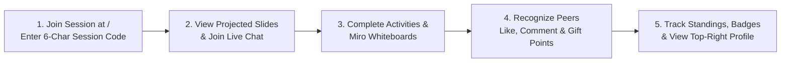

# Participant (`PARTICIPANT`) User Manual

**Role Identifier:** `PARTICIPANT`  
**Join Portal:** `http://localhost:3000/`  
**Workspace Route:** `http://localhost:3000/sessions/[id]/participant`

---

## 1. Role Overview & Experience

As a **Participant (`PARTICIPANT`)**, you join live training sessions to view projected presentations, participate in real-time presentation chat, solve interactive challenges, collaborate on Miro-style whiteboards, recognize your peers with points and likes, and compete on the individual and team leaderboards.

---

## 2. Joining a Training Session (`/`)

1. Open `http://localhost:3000/` in your browser.
2. Enter the **6-Character Session Code** provided by your facilitator (e.g., `A7B9X2`).
3. Enter your **Display Name** (or sign in with your Participant username/password if provided by your organization).
4. Click **Join Session**.
   > **Automatic Reconnection:** If you accidentally refresh your browser or temporarily lose Wi-Fi, TGMS automatically restores your session, team assignment, points, and peer point budget using your recovery token.

---

## 3. Navigating Your Participant Workspace

### 3.1 Top Header Bar & Your Profile Avatar
At the top of your Participant screen (`/sessions/[id]/participant`):
- **Session Title & Connection Indicator**: Confirms you are connected live (`LIVE`).
- **Team Badge**: Shows your assigned team name once the facilitator splits the room into teams.
- **Score & Peer Budget Pill**: Displays your **Total Earned Points** and your remaining **Peer Point Budget** (starts at **20 Peer Points**).
- **Standings Button**: Smoothly scrolls down to the live **Individual & Team Leaderboard** at the bottom of the page (`#session-leaderboard`).
- **Top-Right Avatar Button**:
  - Click your **Avatar** in the upper-right corner at any time to open your **Participant Profile Modal**:
    - **Overview Tab**: Your profile details, session summary, total points, and remaining peer point budget.
    - **Interactions Tab**: Every response, sticky note, whiteboard, presentation chat message, and comment you have submitted.
    - **Points & Awards Tab**: Your complete point ledger history (who gave you points and why) and all digital **Badges** earned.
    - **Edit Info & Settings Tab**: Update your display name, username, email, bio, organization, avatar color, or password (or open `/settings`).
    - **Download JSON**: Download a personal `.json` archive of your interactions and achievements.

---

## 4. Viewing Projected Slides & Presentation Live Chat

### 4.1 Opening the Projected Presentation
When your facilitator projects their Canva presentation or uploaded slide deck:
1. A pulsing **Floating Slide Projection Icon / Banner** (*"Facilitator is projecting slides — Click to Open"*) appears on your screen.
2. Click the icon to open the **Projected Presentation Window**:
   - You can view the slides in the floating window or click **Fullscreen** (`Maximize`) for a full-screen view.

### 4.2 Interactive vs. Synchronized Slide Navigation
Depending on the mode chosen by your facilitator:
- **Interactive Navigation ON (`Interactive Mode`)**: You can use the **Prev** and **Next** buttons (or slide controls) to browse through the presentation slides at your own pace.
- **Interactive Navigation OFF (`Synced to Presenter`)**: A **"Synced to Presenter (Slide #N)"** badge is displayed. Your slide view automatically follows the facilitator's exact slide in real time as they explain the material.

### 4.3 Participating in Real-Time Presentation Live Chat
When the facilitator enables Live Chat during a presentation:
1. The **Live Presentation Chat** panel appears beside the slides.
2. **Hide / Unhide Chat**: Click the **Hide Chat** / **Show Chat** button in the viewer header at any time to collapse the chat panel if you want a wider view of the slides, or expand it to join the discussion.
3. **Sending Messages & Replies**:
   - Type a question or insight in the chat box and press **Send**.
   - Click **Reply** on any peer's or facilitator's message to start a threaded conversation, or click the **Heart / Like** button to react.
4. **Real-Time Notifications & Confirmation Effects**:
   - Whenever you send a message or comment, an animated **Sent Confirmation** toast confirms delivery.
   - When new messages arrive in live chat or when the facilitator replies/awards points to your message, an instant notification alerts you in real time.

---

## 5. Participating in Interactive Activities & Miro Whiteboards

When the facilitator launches an activity, your main workspace automatically switches to that challenge and displays the **Synchronized Digital Timer** if a countdown is active:

1. **Open Questions & Sticky Notes**:
   - Type your response, choose a sticky-note color, and click **Submit**.
   - Depending on the facilitator's **Reveal Mode**, peer responses will appear either immediately (`IMMEDIATE`) or as soon as the timer locks (`UPON_LOCK`).
2. **Live Polls & Trivia Quizzes**:
   - Select your answer option and click **Submit Vote** before the timer expires.
3. **Word Cloud**:
   - Submit short words or phrases; watch the live word cloud grow as classmates submit matching terms.
4. **Q&A Session**:
   - Submit questions (optionally anonymously) and upvote questions submitted by peers.
5. **Priority Ranking**:
   - Reorder the items from highest to lowest priority and submit your ranking.
6. **Miro-Style Collaborative Whiteboards (`Individual`, `Team`, or `Public`)**:
   - Use the Excalidraw toolbar to sketch diagrams, add shapes, draw arrows, or place **Sticky Notes**.
   - Click **Templates** in the whiteboard toolbar to stamp ready-made visual frameworks onto the board:
     - **Kanban Board** (*To Do / In Progress / Done*)
     - **Mind Map** (*Central Node & Radial Branches*)
     - **SWOT Analysis** (*Strengths, Weaknesses, Opportunities, Threats*)
     - **Sprint Retrospective** (*Went Well, To Improve, Action Items*)
     - **Flowchart** (*Process Steps & Decision Diamond*)
     - **Brainstorming Sticky Grid**
   - Click **Submit Whiteboard** to publish your individual or team board so the facilitator can spotlight it and peers can award points!

---

## 6. Peer Recognition: Likes, Comments & Gifting Peer Points

You play an active role in recognizing great work from your classmates—both on the main activity board and inside the **Projected Work Modal** when the facilitator spotlights a submission:

1. **Free Reactions (`Like`)**:
   - Click the **Like / Thumbs Up** button on any peer's response or whiteboard. Reactions are free and unlimited.
2. **Threaded Comments**:
   - Click **Comment** on any peer submission to leave constructive feedback or reply to an existing comment thread.
3. **Gifting Peer Points (`+1`, `+3`, `+5`)**:
   - Every participant starts the session with a **20-Point Peer Budget** (gifting from this budget does **not** reduce your own earned score!).
   - Click **Gift Points** on a classmate's response or whiteboard (you cannot award points to yourself).
   - Select **`+1`**, **`+3`**, or **`+5`** points, write a short reason (e.g., *"Great SWOT diagram!"*), and click **Send Points**.
   - An animated **Confirmation Effect** confirms your gift was sent, and your classmate immediately receives a celebratory **Pop-Up Award Notification** on their screen!

---

## 7. Receiving Awards, Badges & Checking the Leaderboard

- **Celebratory Pop-Up Notifications**: Whenever the facilitator or a peer awards you points, leaves a comment on your work, or grants you a **Digital Badge**, an animated celebration modal pops up on your screen showing the points/badge, who sent it, and their message.
- **Session Standings (`#session-leaderboard`)**: Scroll to the bottom of your screen (or click **Standings** in the header) to view live **Individual Rankings** and **Team Standings**.
- **Inspecting Classmates**: Click on a participant's avatar or name in the roster to view their public session profile, points, and earned badges.
