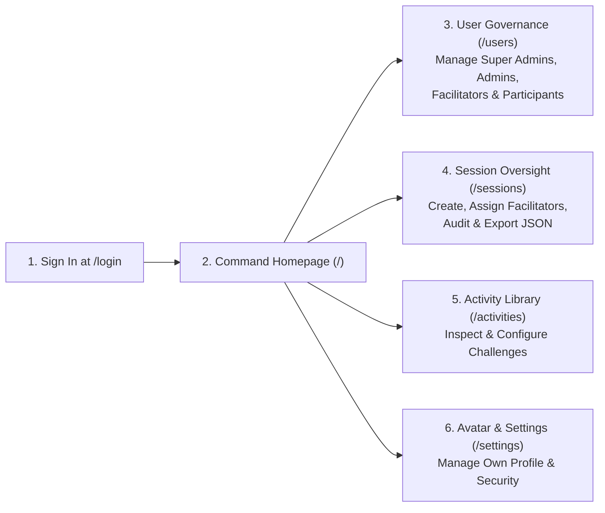

# Super Administrator (`SUPER_ADMIN`) User Manual

**Role Identifier:** `SUPER_ADMIN`  
**Sign-In Portal:** `http://localhost:3000/login`  
**Primary Landing Page:** Command Homepage (`http://localhost:3000/`)

---

## 1. Role Overview & Authority

As a **Super Administrator**, you hold the highest level of governance and operational authority in the **Training Game Management System (TGMS)**. You have unrestricted access to:
- **Full User Lifecycle Management**: Create, bulk-generate, inspect, edit, and delete accounts across **all four roles** (`SUPER_ADMIN`, `ADMIN`, `FACILITATOR`, and `PARTICIPANT`).
- **System-Wide Session Oversight**: View, launch, join, moderate, conclude, or delete any session created by any facilitator across the organization.
- **Session Assignment & Reassignment**: Assign or transfer ownership of any training session to any facilitator.
- **Complete Data Auditing & JSON Export**: Inspect detailed user profiles, audit created sessions, and download complete `schema_version: "1.0"` JSON interaction datasets for any session or participant.

---

## 2. Signing In & Navigating the Command Homepage

### 2.1 Signing In
1. Navigate to the **Facilitator & Admin Sign In** portal at `/login`.
   > **Note:** Do not use the Session Code form on `/`; Session Codes are exclusively for participants joining a live classroom.
2. Enter your **Username** (e.g., `superadmin_sarah` or `superadmin_david`) and **Password**.
3. Click **Sign In to Command Center**.
4. You will be redirected automatically to your **Command Homepage** (`/`).

### 2.2 Navigating the Command Homepage (`/`)
Upon login, the root page (`/`) transforms into your staff command center:
- **Top Navigation Bar**:
  - **Sessions (`/sessions`)**: Manage all sessions and facilitator assignments.
  - **Activities (`/activities`)**: Browse and manage interactive activity configurations.
  - **Users (`/users`)**: Full user directory and account administration.
  - **Top-Right User Avatar**: Click your avatar badge in the upper-right corner at any time to open your **Profile & Settings Modal** or navigate to `/settings`.
- **Paginated Session Directory**:
  - Displays training sessions across the platform (`6` sessions per page) with **Previous** and **Next** pagination controls.
  - Each session card shows its **Status Badge** (`ACTIVE`, `WAITING`, `CONCLUDED`), **6-Character Session Code**, **Facilitator Name**, **Participant Count**, and quick actions to open the **Facilitator Dashboard**, **Projector View**, or **Export JSON**.

---

## 3. Managing Users & Roles (`/users`)

Navigate to `/users` to manage all accounts in the system.

### 3.1 Creating a Single User Account
1. Locate the **Create User** panel on the `/users` page.
2. Fill in:
   - **Full Name** (e.g., *"Dr. Maya Lin"*)
   - **Username** (e.g., `facilitator_maya`)
   - **Email Address** (optional/unique)
   - **Password**
   - **Role**: Select from `PARTICIPANT`, `FACILITATOR`, `ADMIN`, or `SUPER_ADMIN`.
     > **Exclusive Privilege:** Only `SUPER_ADMIN` can create or modify another `SUPER_ADMIN` or `ADMIN` account.
3. Click **Create User**.

### 3.2 Bulk-Creating Users for Cohorts
1. Use the **Bulk Generate Users** tool on `/users` when onboarding a large training class or multiple facilitators.
2. Specify the **Role**, **Prefix**, and **Count** (or paste a list of names/usernames).
3. Submit to provision all accounts simultaneously.

### 3.3 Inspecting Profiles ("View Profile")
1. In the User Directory table, locate any user and click the **View Profile** button (formerly labeled *"Inspect"*).
2. The **Profile & Inspection Modal** opens with role-specific tabs:
   - **For Facilitators, Admins & Super Admins**:
     - Displays **Profile Information** (Name, Username, Email, Organization, Bio, Role badge).
     - Displays summary counters for **Total Sessions Created / Hosted**, **Active Sessions**, and **Total Activities**.
     - **Created Sessions Tab**: Lists every session created or hosted by that facilitator, including session title, 6-character code, status, participant count, activity count, creation date, and a direct button to open the session dashboard.
   - **For Participants**:
     - **Overview Tab**: Displays session participation summary, total points, peer point budget remaining, and team assignment.
     - **Interactions Tab**: Lists all submitted responses, sticky notes, whiteboard submissions, presentation live chat messages, and threaded comments.
     - **Points & Awards Tab**: Displays the immutable point ledger history and earned digital badges.
     - **Download JSON**: Exports that participant's complete record and interaction history as a `.json` file.
   - **Edit Info & Settings Tab**: Allows you to directly update the user's display name, username, email, organization, bio, avatar color, or password.

### 3.4 Changing Roles or Deleting Users
1. In the `/users` table, use the **Role Dropdown** or edit action to promote/demote users between `PARTICIPANT`, `FACILITATOR`, `ADMIN`, and `SUPER_ADMIN`.
2. Click **Delete** next to any user account to permanently remove them from the system.

---

## 4. Overseeing & Assigning Sessions (`/sessions`)

Navigate to `/sessions` to oversee all training sessions.

### 4.1 Creating a Session & Assigning a Facilitator
1. Click **Create New Session** (on `/` or `/sessions/create`).
2. Enter the **Session Title** and **Description**.
3. As a `SUPER_ADMIN`, you can select **Assign Facilitator** to designate yourself or any `FACILITATOR` / `ADMIN` as the session host.
4. Click **Create Session** to generate a unique 6-character **Session Code**.

### 4.2 Reassigning an Existing Session to Another Facilitator
1. On the `/sessions` page (or inside the session management controls), locate the target session.
2. Use the **Assign Facilitator** selector (`PATCH /api/sessions/[id]/assign`) to transfer the session to a different facilitator.
3. The newly assigned facilitator will immediately see the session on their Command Homepage (`/`).

### 4.3 Stepping Into Any Live Session
As a `SUPER_ADMIN`, you have full facilitator privileges inside any session:
- Click **Facilitator View** (`/sessions/[id]/facilitator`) to control slides, toggle Interactive Navigation, moderate Presentation Live Chat, launch activities, run timers, award points/badges, or conclude the session.
- Click **Projector View** (`/sessions/[id]/projector`) to open the big-screen room display.

---

## 5. Auditing & Exporting Session Datasets

### 5.1 Full Session JSON Export
1. From `/sessions`, `/`, or the top bar of `/sessions/[id]/facilitator`, click **Export JSON** (`GET /api/sessions/[id]/export/json`).
2. A complete, structured `.json` file (`schema_version: "1.0"`) downloads immediately, containing:
   - Session metadata & presentation configuration
   - Full participant roster with user profiles, teams, and point totals
   - All activities (`OPEN_QUESTION`, `POLL`, `QUIZ`, `WORD_CLOUD`, `QA`, `RANKING`, `WHITEBOARD_*`)
   - All participant responses, whiteboard scene states (`Excalidraw` JSON), reactions, and threaded comments
   - All **Presentation Live Chat** messages, replies, and inline facilitator feedback
   - Complete **Point Ledger** transactions and **Participant Badges**
   - Chronological **Event Audit Log**

---

## 6. Managing Your Own Profile & Settings (`/settings`)

1. Click your **Avatar** in the top-right corner of any page.
2. Select the **Edit Info & Settings** tab inside the modal, or click **Open Full Settings Page** (`/settings`).
3. Update your **Display Name**, **Username**, **Email**, **Organization / Department**, **Bio**, **Avatar Badge Color**, or **Password**, then click **Save Changes**.
