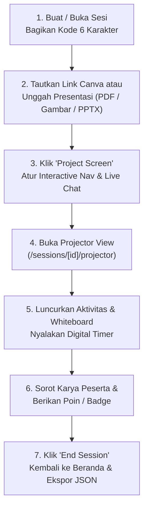

# Buku Panduan Pengguna: Fasilitator (`FACILITATOR`)

**Identitas Role:** `FACILITATOR`  
**Portal Login Staf:** `http://localhost:3000/login`  
**Halaman Utama (Beranda):** Facilitator Command Homepage (`http://localhost:3000/`)

---

## 1. Gambaran Umum Peran & Fitur Fasilitator

Sebagai **Fasilitator (`FACILITATOR`)**, Anda adalah instruktur dan pengarah permainan (*game master*) yang merancang, memulai, dan memandu jalannya sesi pelatihan interaktif secara langsung (*real-time*).

### Apa Saja yang Dapat Anda Lakukan?
- **Membuat & Memandu Sesi Pelatihan Sendiri**: Membuat sesi pelatihan baru, membagikan **Kode Sesi 6 Karakter** kepada peserta, dan mengelola daftar sesi Anda melalui beranda terpaginasi.
- **Menautkan Slide Canva atau Mengunggah File Presentasi**: Menautkan link presentasi Canva secara utuh (tanpa perlu membatasi nomor slide), menghapus tautan kapan saja, atau mengunggah file presentasi (`PDF`, `Gambar Slide`, atau `PPTX`).
- **Memproyeksikan Layar & Mengatur Sinkronisasi Slide**: Menampilkan slide presentasi secara langsung ke layar peserta dan layar proyektor, serta mengatur apakah peserta bebas berpindah slide sendiri (**Interactive Navigation: ON**) atau otomatis mengikuti slide yang sedang Anda jelaskan (**Interactive Navigation: OFF**).
- **Memandu *Real-Time Presentation Live Chat***: Mengaktifkan/menonaktifkan fitur chat saat presentasi berlangsung, menyembunyikan/menampilkan panel chat (**Hide Chat / Show Chat**), membalas pesan dengan umpan balik (*feedback*), serta langsung memberikan poin (`+2`, `+5`, `+10`) atau lencana penghargaan (*Badges*) dari dalam chat.
- **Menjalankan Aktivitas Interaktif & *Miro Collaborative Whiteboard***: Meluncurkan kuis, *polling*, *word cloud*, tanya jawab (*Q&A*), *ranking*, *sticky notes*, serta papan tulis kolaboratif Excalidraw lengkap dengan 6 *template* siap pakai (*Kanban Board*, *Mind Map*, *SWOT Analysis*, *Retrospective*, *Flowchart*, dan *Sticky Grid*).
- **Mengelola Timer, Tim, Skor & Ekspor JSON**: Menjalankan *digital timer* tersinkronisasi, membagi peserta ke dalam tim secara otomatis, menampilkan karya peserta ke layar utama (*Project to Stage*), memeriksa profil peserta, dan mengunduh seluruh data sesi dalam format JSON.

### Batasan Hak Akses Fasilitator
> **Catatan Penting Mengenai Hak Akses:**
> 1. **Manajemen Pengguna (`/users`)**: Fasilitator **tidak dapat** membuat, mengubah, atau menghapus akun pengguna lain (fitur tersebut hanya untuk `ADMIN` dan `SUPER_ADMIN`). Namun, Anda tetap dapat mengklik **View Profile** untuk melihat profil peserta/rekan fasilitator, serta mengubah profil dan kata sandi **milik Anda sendiri** melalui Avatar di pojok kanan atas atau halaman `/settings`.
> 2. **Penugasan Sesi**: Fasilitator hanya mengelola sesi yang dibuatnya sendiri (atau yang ditugaskan kepadanya oleh Admin) dan **tidak dapat** mengalihkan kepemilikan sesi kepada fasilitator lain.

---

## 2. Cara Login & Beranda Fasilitator

### 2.1 Langkah Login (`/login`)
1. Buka `http://localhost:3000/login` (**Facilitator & Admin Sign In**).
   > **Catatan:** Anda tidak memerlukan *Session Code* untuk login. Kolom *Session Code* di halaman `/` khusus untuk peserta.
2. Masukkan **Username** Anda (contoh akun bawaan: `facilitator_maya` atau `facilitator_sam`) dan **Password**.
3. Klik **Sign In to Command Center**.

### 2.2 Beranda Komando Fasilitator (`/`)
Setelah login (atau setelah Anda mengakhiri sebuah sesi), Anda akan berada di **Beranda Komando (`/`)**:
- **Tampilan Bersih Bebas Riwayat Sesi Sebelumnya**: Seluruh interaksi, poin, dan pesan chat dari sesi-sesi sebelumnya disembunyikan dari halaman utama sehingga beranda Anda tetap rapi.
- **Daftar Sesi dengan Paginasi**: Menampilkan seluruh sesi yang telah Anda buat (`6` sesi per halaman, dilengkapi tombol **Previous** dan **Next**).
- **Avatar di Pojok Kanan Atas**: Klik avatar Anda di pojok kanan atas kapan saja untuk melihat **Profil Fasilitator** Anda (termasuk jumlah total sesi yang telah Anda buat/pandu beserta daftar rinciannya di tab **Created Sessions**) atau mengubah pengaturan akun Anda.

---

## 3. Panduan Langkah demi Langkah Memandu Sesi Pelatihan

### Langkah 1: Membuat atau Membuka Sesi
1. Dari Beranda Komando (`/`), klik **Create New Session** (atau klik kartu sesi yang sudah ada).
2. Masukkan **Judul Sesi** dan **Deskripsi**, lalu klik **Create**.
3. Buka **Facilitator Dashboard** (`/sessions/[id]/facilitator`).
4. Bagikan **Kode Sesi 6 Karakter** yang tertera di bagian atas layar kepada para peserta.

---

### Langkah 2: Menautkan Link Canva atau Mengunggah File Presentasi
Pada panel **Presentation & Stage Studio** di Facilitator Dashboard:

1. **Opsi A — Menautkan Link Presentasi Canva**:
   - Tempelkan (*paste*) URL presentasi Canva Anda pada kolom **Canva Presentation Link**, lalu klik **Link Presentation**.
   - **Tanpa Batasan Nomor Slide**: Anda tidak perlu memasukkan nomor slide; seluruh slide di dalam presentasi Canva Anda langsung terhubung dan dapat ditampilkan.
   - **Menghapus Link Canva**: Klik tombol merah **Delete / Remove Link** (ikon tempat sampah) kapan saja jika Anda ingin menghapus tautan Canva atau menggantinya dengan materi lain.
2. **Opsi B — Mengunggah File Presentasi Sendiri**:
   - Klik tombol **Upload Presentation** untuk mengunggah materi presentasi berformat **PDF (`.pdf`)**, **Kumpulan Gambar Slide (`.png`, `.jpg`, `.webp`)**, atau **PowerPoint (`.pptx`)**.

---

### Langkah 3: Memproyeksikan Layar & Mengatur Navigasi Slide Peserta
Setelah presentasi Canva atau file unggahan terhubung:

1. **Memulai Proyeksi Layar (*Project Screen*)**:
   - Klik tombol **Project Screen to Participants**.
   - Secara otomatis, sebuah ikon mengambang (*floating icon*) akan muncul di layar seluruh peserta untuk memberi tahu bahwa Anda sedang membagikan slide presentasi.
2. **Mengatur Navigasi Interaktif (`Interactive Nav: ON / OFF`)**:
   - **Jika Interactive Navigation ON**: Peserta dapat membuka jendela presentasi, memperbesar ke layar penuh (*fullscreen*), dan berpindah-pindah slide maju/mundur secara mandiri.
   - **Jika Interactive Navigation OFF (Sinkron dengan Presenter)**: Tombol navigasi slide di layar peserta akan dikunci. Setiap kali Anda menekan tombol **Prev Slide** atau **Next Slide** di dashboard fasilitator, layar seluruh peserta dan layar Proyektor otomatis berpindah mengikuti slide yang sedang Anda jelaskan secara *real-time*!
3. **Mengaktifkan / Menonaktifkan *Presentation Live Chat* (`Chat: ON / OFF`)**:
   - Aktifkan **Enable Chat** agar peserta dapat mengirim pertanyaan, tanggapan, dan berdiskusi secara langsung selama presentasi.
   - Nonaktifkan **Disable Chat** apabila Anda ingin peserta fokus penuh mendengarkan penjelasan tanpa mengirim pesan chat.
4. **Menyembunyikan / Menampilkan Panel Live Chat (`Hide Chat` / `Show Chat`)**:
   - Klik tombol **Hide Chat** di bagian atas penampil presentasi jika Anda ingin menutup bilah samping chat agar tampilan slide lebih lebar; klik **Show Chat** untuk menampilkannya kembali.

---

### Langkah 4: Memberikan Umpan Balik, Poin & Penghargaan di Live Chat
Selama **Presentation Live Chat** aktif:
1. Setiap pesan baru dari peserta akan langsung muncul secara *real-time* disertai notifikasi.
2. Pada setiap pesan peserta di Live Chat, Anda dapat langsung:
   - Mengklik **Reply / Feedback** untuk memberikan komentar atau umpan balik pembimbingan.
   - Mengklik tombol **`+2`**, **`+5`**, atau **`+10`** untuk langsung menghadiahkan poin tambahan kepada peserta tersebut.
   - Mengklik **Award Badge** untuk memberikan lencana penghargaan atas pertanyaan atau ide yang cemerlang.
3. Setiap kali Anda selesai mengirim pesan, umpan balik, poin, atau penghargaan, sebuah **Efek Konfirmasi Animasi** akan muncul di pojok layar sebagai tanda bahwa tindakan Anda telah terkirim.

---

### Langkah 5: Membuka Layar Proyektor (*Projector View*)
1. Klik tombol **Open Projector View** (`/sessions/[id]/projector`) di bilah atas dashboard fasilitator, lalu tampilkan jendela tersebut pada proyektor kelas atau *screen share* rapat daring.
2. Tampilan **Projector View** dilengkapi dengan:
   - **Ukuran Slide Presentasi Besar & Proporsional** (`w-full h-full max-h-[85vh] rounded-2xl overflow-hidden shadow-2xl border border-slate-800 bg-black`).
   - **Panel Live Presentation Chat Real-Time** di samping slide, lengkap dengan tombol **Hide Chat / Show Chat**.
   - **Digital Timer Tersinkronisasi** di bagian atas layar setiap kali hitung mundur aktivitas sedang berjalan.

---

### Langkah 6: Meluncurkan Aktivitas Interaktif & *Miro Collaborative Whiteboard*
1. Pada panel **Activities**, klik **Create Activity** dan pilih jenis tantangan:
   - **Open Question / Sticky Notes**: Pengumpulan ide dengan pengaturan **Reveal Mode** (`IMMEDIATE` langsung tampil atau `UPON_LOCK` disembunyikan hingga waktu habis).
   - **Live Poll / Trivia Quiz**: Pemungutan suara atau kuis pilihan ganda dengan penilaian otomatis.
   - **Word Cloud**: Awan kata interaktif berdasarkan frekuensi jawaban peserta.
   - **Q&A Session**: Sesi tanya jawab dengan fitur *upvote* dan penanda pertanyaan terjawab.
   - **Priority Ranking**: Pengurutan prioritas menggunakan metode perhitungan Borda.
   - **Collaborative Whiteboard (`WHITEBOARD_INDIVIDUAL`, `WHITEBOARD_TEAM`, `WHITEBOARD_PUBLIC`)**:
     - Papan tulis digital berbasis Excalidraw dengan 6 **Template Ala Miro**: *Kanban Board*, *Mind Map*, *SWOT Analysis*, *Sprint Retrospective*, *Flowchart*, dan *Brainstorming Sticky Grid*.
2. **Mengendalikan Status Aktivitas**:
   - Ubah status aktivitas dari `DRAFT` → **`ACTIVE`** (membuka pengumpulan jawaban peserta) → **`LOCKED`** (mengunci jawaban & membuka hasil) → **`COMPLETED`**.
3. **Menjalankan Digital Timer**:
   - Pilih durasi waktu (mis. `60s`, `180s`, `300s`) lalu klik **Start Timer**. Anda dapat melakukan **Pause**, **Resume**, menambah **`+30s`**, atau **Stop** kapan saja.
4. **Menyorot Karya Peserta ke Layar Utama (*Project to Stage*)**:
   - Klik **Project to Stage** pada jawaban atau *whiteboard* peserta/tim mana pun untuk menampilkannya di layar seluruh peserta (`ProjectedWorkModal`) sehingga peserta lain dapat mengapresiasi (*like*), memberi komentar, dan menghadiahkan poin rekan (*peer points*).

---

### Langkah 7: Memeriksa Profil Peserta, Ekspor JSON & Mengakhiri Sesi
1. **Memeriksa Detail Peserta**:
   - Klik nama peserta di daftar peserta (**Session Roster**) untuk membuka modal **View Profile** yang menampilkan informasi peserta, info sesi, rincian poin, penghargaan (*badges*), *whiteboard*, seluruh interaksi, serta tombol **Download JSON**.
2. **Mengunduh Dataset Sesi Lengkap (`Export JSON`)**:
   - Klik tombol **Export JSON** di bagian atas dashboard untuk mengunduh seluruh data sesi (termasuk pesan chat, balasan, *whiteboard*, komentar, poin, dan penghargaan).
3. **Mengakhiri Sesi (`End Session`)**:
   - Setelah sesi pelatihan selesai, klik tombol **End Session** di bilah atas dan konfirmasi.
   - Status sesi akan berubah menjadi `CONCLUDED`, dan Anda akan langsung dibawa kembali ke **Beranda Komando (`/`)** yang bersih dengan daftar sesi terpaginasi.
