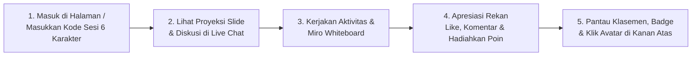

# Buku Panduan Pengguna: Peserta (`PARTICIPANT`)

**Identitas Role:** `PARTICIPANT`  
**Portal Masuk Sesi:** `http://localhost:3000/`  
**Halaman Ruang Kerja Peserta:** `http://localhost:3000/sessions/[id]/participant`

---

## 1. Gambaran Umum Peran Peserta

Sebagai **Peserta (`PARTICIPANT`)**, Anda bergabung ke dalam sesi pelatihan langsung menggunakan **Kode Sesi 6 Karakter** untuk mengikuti slide presentasi yang dibagikan fasilitator, berdiskusi di *Live Presentation Chat*, mengerjakan tantangan interaktif, berkolaborasi di papan tulis digital (*Miro-style Whiteboard*), memberikan apresiasi dan poin kepada rekan sekelas, serta mengumpulkan poin dan lencana penghargaan (*Badges*) di papan klasemen (*Leaderboard*).

---

## 2. Cara Bergabung ke Sesi Pelatihan (`/`)

1. Buka browser Anda dan akses `http://localhost:3000/`.
2. Masukkan **Kode Sesi 6 Karakter (*Session Code*)** yang diberikan oleh fasilitator Anda (contoh: `A7B9X2`).
3. Masukkan **Nama Tampilan (*Display Name*)** Anda (atau masuk menggunakan *username* dan *password* peserta jika telah disediakan oleh penyelenggara).
4. Klik tombol **Join Session**.
   > **Pemulihan Koneksi Otomatis:** Jika halaman browser Anda tidak sengaja ter-refresh atau koneksi internet sempat terputus, sistem akan otomatis memulihkan sesi, tim, perolehan poin, dan sisa kuota poin rekan Anda tanpa kehilangan data.

---

## 3. Mengenal Ruang Kerja Peserta & Avatar Profil

Pada bilah atas (*Top Header Bar*) halaman ruang kerja peserta (`/sessions/[id]/participant`), terdapat:
- **Judul Sesi & Indikator Koneksi (`LIVE`)**: Menandakan perangkat Anda terhubung secara *real-time* dengan ruang pelatihan.
- **Lencana Tim (*Team Badge*)**: Menampilkan nama tim Anda apabila fasilitator telah membagi kelas ke dalam kelompok.
- **Indikator Skor & Kuota Poin Rekan (*Peer Point Budget*)**: Menampilkan **Total Poin Anda** serta sisa **Kuota Poin Rekan** (setiap peserta mendapatkan modal awal **20 Poin Rekan** untuk dihadiahkan kepada peserta lain).
- **Tombol Standings (Klasemen)**: Menggulir layar secara halus menuju tabel **Papan Klasemen Individu & Tim** di bagian bawah halaman (`#session-leaderboard`).
- **Avatar Profil di Pojok Kanan Atas**:
  - Klik ikon **Avatar** Anda di pojok kanan atas kapan saja untuk membuka **Jendela Profil Peserta**:
    - **Tab Overview**: Informasi diri Anda, info sesi, total poin, dan sisa kuota poin rekan.
    - **Tab Interactions**: Daftar seluruh jawaban, *sticky notes*, *whiteboard*, pesan *Live Presentation Chat*, dan komentar yang pernah Anda kirimkan.
    - **Tab Points & Awards**: Riwayat lengkap perolehan poin (siapa yang memberi poin beserta alasannya) dan daftar lencana (**Badges**) yang Anda raih.
    - **Tab Edit Info & Settings**: Mengubah nama tampilan, username, email, bio, unit kerja/organisasi, warna avatar, atau kata sandi Anda (juga dapat diakses melalui halaman `/settings`).
    - **Tombol Download JSON**: Mengunduh arsip lengkap interaksi dan pencapaian Anda dalam format `.json`.

---

## 4. Melihat Slide Presentasi & *Real-Time Presentation Live Chat*

### 4.1 Membuka Jendela Slide yang Diproyeksikan Fasilitator
Saat fasilitator membagikan/memproyeksikan slide presentasi (Canva atau slide unggahan):
1. Sebuah **Ikon / Banner Mengambang (*Floating Icon*)** akan muncul di layar Anda dengan pemberitahuan bahwa fasilitator sedang membagikan slide presentasi.
2. Klik ikon tersebut untuk membuka **Jendela Proyeksi Presentasi**:
   - Anda dapat melihat slide di dalam jendela mengambang tersebut atau mengklik tombol **Fullscreen** (`Maximize`) agar tampil satu layar penuh.

### 4.2 Mode Navigasi Slide: Interaktif vs. Sinkron dengan Presenter
Tergantung pengaturan yang dipilih oleh fasilitator:
- **Interactive Navigation ON (*Mode Interaktif*)**: Anda dapat menekan tombol **Prev** dan **Next** untuk membuka dan mempelajari halaman slide maju atau mundur sesuai kecepatan Anda sendiri.
- **Interactive Navigation OFF (*Synced to Presenter*)**: Muncul penanda **"Synced to Presenter (Slide #N)"**. Tampilan slide di layar Anda akan otomatis berpindah mengikuti halaman slide yang sedang dijelaskan oleh fasilitator secara *real-time*.

### 4.3 Berdiskusi di *Real-Time Presentation Live Chat*
Apabila fasilitator mengaktifkan fitur chat selama presentasi:
1. Panel **Live Presentation Chat** akan tampil di samping slide presentasi.
2. **Menyembunyikan / Menampilkan Chat (`Hide Chat` / `Show Chat`)**: Klik tombol **Hide Chat** di bagian atas jendela presentasi jika Anda ingin menyembunyikan kolom chat agar slide terlihat lebih besar; klik **Show Chat** untuk membuka kembali kolom chat.
3. **Mengirim Pesan, Balasan & Reaksi**:
   - Ketik pertanyaan atau pendapat Anda pada kolom pesan lalu klik **Send**.
   - Klik **Reply** pada pesan teman atau fasilitator untuk membalas secara berjenjang (*threaded reply*), atau klik ikon **Like / Hati** untuk menyukai pesan.
4. **Notifikasi Pesan & Efek Konfirmasi**:
   - Saat Anda mengirim pesan atau komentar, muncul **Efek Konfirmasi Animasi** yang menandakan pesan telah terkirim.
   - Saat ada pesan baru masuk di *live chat* atau saat fasilitator memberikan balasan/poin pada pesan Anda, notifikasi *real-time* akan langsung muncul di layar Anda.

---

## 5. Mengikuti Aktivitas Interaktif & *Miro Whiteboard*

Ketika fasilitator mengaktifkan sebuah aktivitas, layar Anda otomatis menampilkan tantangan tersebut beserta **Digital Timer** hitung mundur di bagian atas:

1. **Pertanyaan Terbuka & *Sticky Notes***:
   - Ketik jawaban atau ide Anda, pilih warna kartu *sticky note*, lalu klik **Submit**.
2. **Polling Langsung & Kuis Trivia (`POLL` / `QUIZ`)**:
   - Pilih salah satu opsi jawaban sebelum waktu habis dan klik **Submit Vote**.
3. **Awan Kata (`WORD_CLOUD`)**:
   - Kirimkan kata kunci singkat; awan kata akan bergerak secara langsung mengikuti kata yang paling banyak dikirim peserta.
4. **Tanya Jawab (`QA`)**:
   - Ajukan pertanyaan (bisa secara anonim) dan berikan *upvote* pada pertanyaan teman yang menurut Anda penting.
5. **Pengurutan Prioritas (`RANKING`)**:
   - Urutkan daftar pilihan dari prioritas tertinggi ke terendah lalu kirimkan.
6. **Papan Tulis Kolaboratif Ala Miro (`Collaborative Whiteboard`)**:
   - Gunakan kanvas Excalidraw untuk menggambar sketsa, membuat bagan, menghubungkan panah, atau menempelkan **Sticky Notes**.
   - Klik menu **Templates** pada bilah alat *whiteboard* untuk langsung memuat kerangka visual siap pakai:
     - **Kanban Board** (*To Do / In Progress / Done*)
     - **Mind Map** (*Peta Pikiran*)
     - **SWOT Analysis** (*Strengths, Weaknesses, Opportunities, Threats*)
     - **Sprint Retrospective** (*Went Well, To Improve, Action Items*)
     - **Flowchart** (*Diagram Alir Proses*)
     - **Brainstorming Sticky Grid**
   - Klik **Submit Whiteboard** untuk mengumpulkan hasil karya individu atau tim Anda agar dapat ditampilkan ke layar utama dan diberi poin oleh rekan lainnya!

---

## 6. Memberikan Apresiasi & Menghadiahkan Poin kepada Rekan (*Peer Rewards*)

Anda dapat memberikan apresiasi terhadap jawaban atau *whiteboard* peserta lain—baik di papan aktivitas maupun saat karya tersebut sedang disorot fasilitator di layar utama (`ProjectedWorkModal`):

1. **Memberikan Reaksi Gratis (`Like`)**:
   - Klik tombol **Like / Jempol** pada karya rekan Anda. Reaksi bersifat gratis dan tidak mengurangi kuota poin.
2. **Memberikan Komentar & Balasan**:
   - Klik **Comment** untuk menuliskan masukan konstruktif atau membalas komentar yang ada.
3. **Menghadiahkan Poin Rekan (`+1`, `+3`, `+5`)**:
   - Setiap peserta memiliki **20 Poin Kuota Rekan (*Peer Point Budget*)** di setiap sesi. Menghadiahkan poin dari kuota ini **tidak mengurangi** skor pribadi Anda!
   - Klik tombol **Gift Points** pada jawaban atau *whiteboard* teman (Anda tidak dapat memberi poin kepada karya sendiri).
   - Pilih nominal **`+1`**, **`+3`**, atau **`+5`** poin, tuliskan alasan singkat (mis. *"Analisis SWOT sangat tajam dan jelas!"*), lalu klik **Send Points**.
   - **Efek Konfirmasi** akan tampil di layar Anda, dan rekan yang menerima poin akan langsung mendapatkan **Pop-Up Notifikasi Penghargaan** yang meriah di layarnya!

---

## 7. Menerima Penghargaan & Memantau Papan Klasemen (*Leaderboard*)

- **Pop-Up Notifikasi Penghargaan**: Setiap kali fasilitator atau rekan peserta memberikan poin, komentar, atau **Badge** kepada Anda, sebuah jendela animasi perayaan akan muncul menampilkan jumlah poin/lencana, nama pemberi, dan pesan apresiasinya.
- **Papan Klasemen (`#session-leaderboard`)**: Gulir ke bagian paling bawah halaman (atau klik tombol **Standings** di bilah atas) untuk memantau peringkat skor **Individu** dan **Tim** secara langsung.
