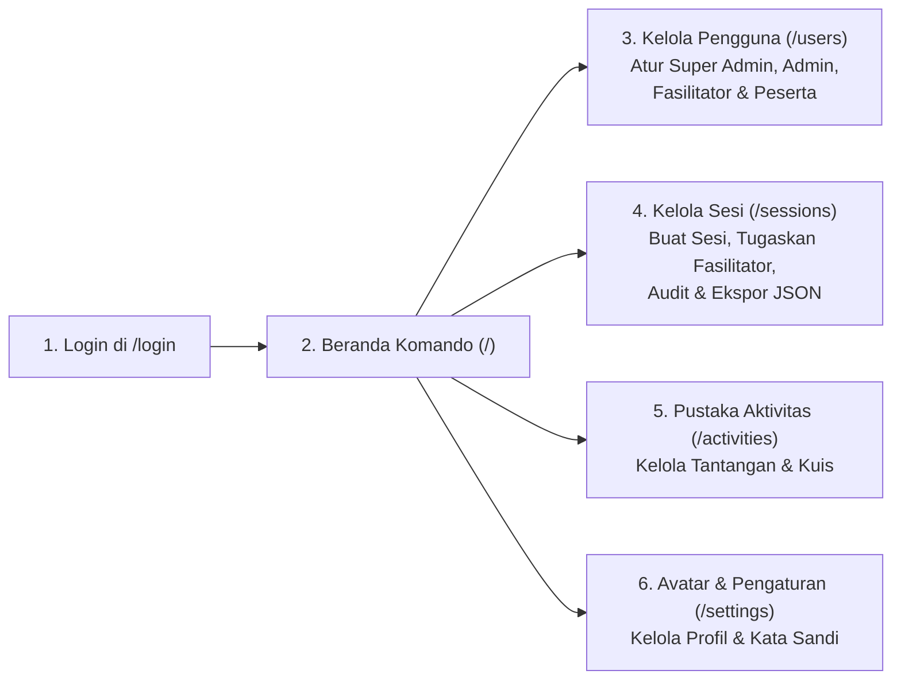

# Buku Panduan Pengguna: Super Administrator (`SUPER_ADMIN`)

**Identitas Role:** `SUPER_ADMIN`  
**Portal Login Staf:** `http://localhost:3000/login`  
**Halaman Utama (Beranda):** Command Homepage (`http://localhost:3000/`)

---

## 1. Gambaran Umum Peran & Wewenang

Sebagai **Super Administrator (`SUPER_ADMIN`)**, Anda memegang otoritas tertinggi dalam tata kelola dan operasional **Training Game Management System (TGMS)**. Anda memiliki akses penuh tanpa batas untuk:

- **Manajemen Siklus Hidup Pengguna Secara Penuh**: Membuat akun tunggal maupun massal (*bulk*), melihat profil detail (**View Profile**), mengubah data/role, serta menghapus akun pada **keempat role pengguna** (`SUPER_ADMIN`, `ADMIN`, `FACILITATOR`, dan `PARTICIPANT`).
- **Pengawasan Seluruh Sesi Pelatihan**: Melihat, membuka, memoderasi, mengendalikan, mengakhiri (*conclude*), atau menghapus sesi pelatihan mana pun yang dibuat oleh fasilitator di seluruh sistem.
- **Penugasan & Pengalihan Sesi (*Session Assignment*)**: Menugaskan atau memindahkan kepemilikan sesi pelatihan kepada fasilitator mana pun.
- **Audit Data & Ekspor JSON Lengkap**: Memeriksa riwayat interaksi, melihat jumlah serta detail sesi yang dibuat oleh setiap fasilitator, dan mengunduh kumpulan data lengkap berformat JSON (`schema_version: "1.0"`).

---

## 2. Cara Login & Navigasi Beranda Komando

### 2.1 Langkah-Langkah Login (`/login`)
1. Buka browser dan arahkan ke halaman **Facilitator & Admin Sign In** di `http://localhost:3000/login`.
   > **Catatan Penting:** Halaman login staf (`/login`) tidak memiliki kolom *Session Code*. *Session Code* di halaman `/` hanya dikhususkan bagi **Peserta (`PARTICIPANT`)**.
2. Masukkan **Username** Anda (contoh akun bawaan: `superadmin_sarah` atau `superadmin_david`) dan **Password**.
3. Klik tombol **Sign In to Command Center**.
4. Sistem akan langsung mengarahkan Anda ke **Beranda Komando (`/`)**.

### 2.2 Navigasi Beranda Komando (`/`)
Setelah berhasil login, halaman utama (`/`) menampilkan pusat kendali staf:
- **Bilah Navigasi Atas (*Top Navigation Bar*)**:
  - **Sessions (`/sessions`)**: Direktori seluruh sesi pelatihan dan pengaturan penugasan fasilitator.
  - **Activities (`/activities`)**: Daftar seluruh aktivitas interaktif lintas sesi.
  - **Users (`/users`)**: Direktori pengguna dan manajemen hak akses (*role*).
  - **Avatar Pengguna (Pojok Kanan Atas)**: Klik ikon avatar Anda di pojok kanan atas kapan saja untuk membuka **Modal Profil & Pengaturan** atau menuju halaman `/settings`.
- **Daftar Sesi dengan Paginasi (*Paginated Session List*)**:
  - Menampilkan daftar sesi pelatihan (`6` sesi per halaman) lengkap dengan tombol navigasi halaman **Previous** dan **Next**.
  - Setiap kartu sesi menampilkan **Status** (`WAITING`, `ACTIVE`, `CONCLUDED`), **Kode Sesi 6 Karakter**, **Nama Fasilitator**, **Jumlah Peserta**, serta tombol pintas ke **Facilitator Dashboard**, **Projector View**, dan **Export JSON**.

---

## 3. Manajemen Pengguna & Hak Akses (`/users`)

Buka menu **Users (`/users`)** untuk mengelola seluruh akun di dalam sistem.

### 3.1 Membuat Akun Pengguna Baru (Tunggal)
1. Pada panel **Create User** di halaman `/users`, isi kolom berikut:
   - **Full Name**: Nama lengkap pengguna (mis. *"Budi Santoso"*).
   - **Username**: Nama pengguna unik untuk login (mis. `facilitator_budi`).
   - **Email Address**: Alamat email pengguna (opsional/unik).
   - **Password**: Kata sandi awal.
   - **Role**: Pilih salah satu dari `PARTICIPANT`, `FACILITATOR`, `ADMIN`, atau `SUPER_ADMIN`.
     > **Hak Istimewa Eksklusif:** Hanya `SUPER_ADMIN` yang dapat membuat, mengubah, atau menghapus akun dengan role `SUPER_ADMIN` maupun `ADMIN`.
2. Klik **Create User** untuk menyimpan.

### 3.2 Membuat Akun Secara Massal (*Bulk User Creation*)
1. Gunakan fitur **Bulk Generate Users** di halaman `/users` saat ingin menyiapkan banyak akun peserta atau fasilitator sekaligus untuk suatu kelas pelatihan.
2. Tentukan **Role**, **Prefix Username**, dan **Jumlah Akun** (atau masukkan daftar nama/username).
3. Klik tombol pembuatan massal untuk memproses seluruh akun secara otomatis.

### 3.3 Memeriksa Profil Pengguna ("View Profile")
1. Pada tabel daftar pengguna di `/users`, klik tombol **View Profile** (sebelumnya bernama *"Inspect"*) pada baris pengguna mana pun.
2. Jendela **Profile & Inspection Modal** akan terbuka dengan informasi yang disesuaikan berdasarkan role pengguna tersebut:
   - **Jika Membuka Profil Fasilitator / Admin / Super Admin**:
     - Menampilkan **Informasi Profil Lengkap** (Nama, Username, Email, Organisasi/Unit Kerja, Bio, dan lencana Role).
     - Menampilkan ringkasan statistik: **Jumlah Sesi yang Dibuat / Dipandu (*Sessions Created / Hosted*)**, **Sesi Aktif**, dan **Total Aktivitas**.
     - **Tab Created Sessions**: Menampilkan daftar rinci seluruh sesi yang pernah dibuat oleh fasilitator tersebut (Judul Sesi, Kode Sesi 6 Karakter, Status `WAITING`/`ACTIVE`/`CONCLUDED`, Jumlah Peserta, Jumlah Aktivitas, Tanggal Dibuat, serta tombol pintas untuk membuka dashboard sesi tersebut).
   - **Jika Membuka Profil Peserta (`PARTICIPANT`)**:
     - **Tab Overview**: Informasi peserta, sesi yang diikuti, total poin, sisa kuota poin rekan (*Peer Point Budget*), dan tim.
     - **Tab Interactions**: Seluruh riwayat jawaban, *sticky notes*, *whiteboard*, pesan *Live Presentation Chat*, dan komentar berjenjang (*replies*).
     - **Tab Points & Awards**: Riwayat transaksi poin (*Point Ledger*) serta lencana penghargaan (*Badges*) yang diperoleh.
     - **Tombol Download JSON**: Mengunduh seluruh data interaksi dan penghargaan peserta tersebut dalam format `.json`.
   - **Tab Edit Info & Settings**: Memungkinkan Anda mengubah nama tampilan, username, email, organisasi, bio, warna avatar, atau mereset kata sandi pengguna tersebut secara langsung.

### 3.4 Mengubah Role atau Menghapus Pengguna
1. Pada tabel `/users`, gunakan pilihan **Role** atau fitur edit untuk mempromosikan maupun menurunkan hak akses pengguna (`PARTICIPANT` ↔ `FACILITATOR` ↔ `ADMIN` ↔ `SUPER_ADMIN`).
2. Klik tombol **Delete** (ikon tempat sampah) pada baris pengguna untuk menghapus akun secara permanen.

---

## 4. Pengawasan Sesi & Penugasan Fasilitator (`/sessions`)

Buka menu **Sessions (`/sessions`)** untuk mengelola seluruh sesi pelatihan.

### 4.1 Membuat Sesi Baru & Menunjuk Fasilitator
1. Klik tombol **Create New Session** (dari `/` atau `/sessions/create`).
2. Isi **Judul Sesi (*Session Title*)** dan **Deskripsi**.
3. Sebagai `SUPER_ADMIN`, pilih nama instruktur pada opsi **Assign Facilitator** untuk menugaskan sesi tersebut kepada diri Anda sendiri atau fasilitator lain.
4. Klik **Create Session**. Sistem akan menghasilkan **Kode Sesi 6 Karakter** secara otomatis.

### 4.2 Mengalihkan Sesi ke Fasilitator Lain (*Reassign Facilitator*)
1. Pada halaman `/sessions`, cari sesi yang ingin dialihkan.
2. Pilih fasilitator baru pada menu dropdown **Assign Facilitator** (`PATCH /api/sessions/[id]/assign`).
3. Sesi tersebut akan langsung muncul di Beranda Komando (`/`) milik fasilitator yang ditunjuk.

### 4.3 Masuk dan Mengendalikan Sesi Langsung
Sebagai `SUPER_ADMIN`, Anda memiliki kendali penuh atas setiap sesi:
- Klik **Facilitator Dashboard** (`/sessions/[id]/facilitator`) untuk menautkan/mengunggah slide presentasi, memproyeksikan layar ke peserta, mengatur **Interactive Navigation**, memoderasi **Presentation Live Chat**, menjalankan **Digital Timer**, membagi tim, memberikan poin/badge, atau mengakhiri sesi (**End Session**).
- Klik **Projector View** (`/sessions/[id]/projector`) untuk menampilkan layar proyektor ruangan.

---

## 5. Audit & Ekspor Data JSON Lengkap

1. Dari halaman `/sessions`, `/`, atau di bagian atas `/sessions/[id]/facilitator`, klik tombol **Export JSON** (`GET /api/sessions/[id]/export/json`).
2. File `.json` terstruktur (`schema_version: "1.0"`) akan langsung terunduh, mencakup:
   - Metadata sesi & konfigurasi slide presentasi (Canva / PDF / Gambar / PPTX)
   - Daftar peserta beserta profil, tim, dan total skor
   - Seluruh aktivitas (`OPEN_QUESTION`, `POLL`, `QUIZ`, `WORD_CLOUD`, `QA`, `RANKING`, `WHITEBOARD_*`)
   - Seluruh jawaban peserta, papan tulis kolaboratif (`Excalidraw` JSON), reaksi (*likes*), dan komentar/balasan
   - Seluruh percakapan **Presentation Live Chat** beserta balasan dan umpan balik fasilitator
   - Catatan mutasi **Point Ledger** dan **Badges** yang diberikan kepada peserta
   - **Event Log** kronologis dari awal hingga akhir sesi

---

## 6. Mengelola Profil & Pengaturan Pribadi (`/settings`)

1. Klik **Avatar** Anda di pojok kanan atas pada halaman mana pun.
2. Pilih tab **Edit Info & Settings** di dalam modal, atau klik **Open Full Settings Page** (`/settings`).
3. Perbarui **Nama Tampilan**, **Username**, **Email**, **Organisasi / Unit Kerja**, **Bio**, **Warna Avatar**, atau **Kata Sandi**, lalu klik **Save Changes**.
